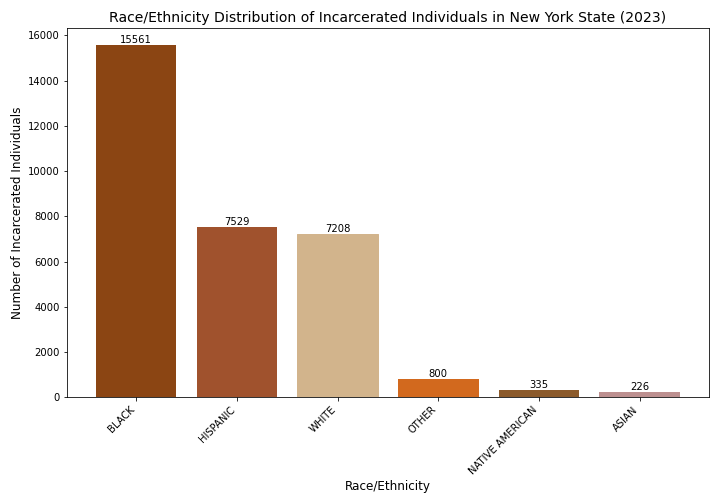
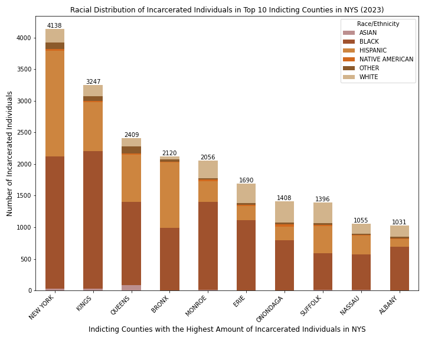
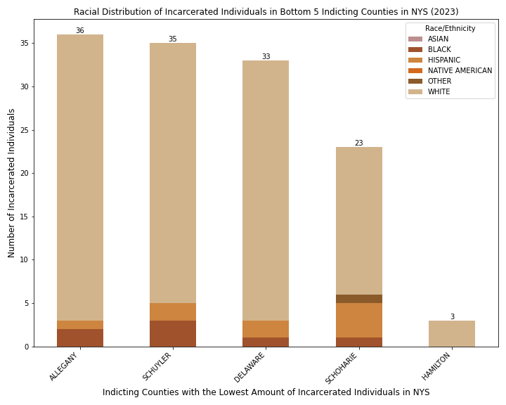
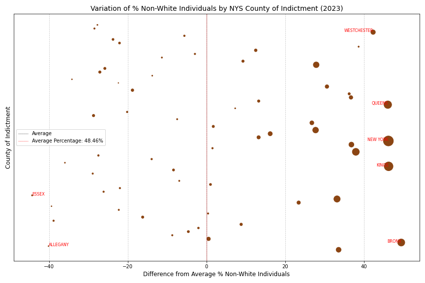

# Analysis of Incarcerated Individuals in New York State

This repository houses a comprehensive analysis of incarcerated individuals' demographics, trends, facilities, and crimes in New York State for the year 2023. It includes scripts written in Python for data processing, visualization, and interpretation. The analysis covers a wide range of aspects, including age, gender, race, time series trends, facility distribution, indicting county demographics, variation from average non-white percentages, choropleth mapping, and crime statistics. Each script is meticulously documented, detailing its purpose and methodology. The provided visualizations offer clear insights into the distribution and characteristics of the incarcerated population, aiding policymakers, researchers, and the public in understanding and addressing issues related to incarceration, demographics, and criminal justice in New York State. 

## Input Data Sources
- [Incarcerated Individuals Under Custody Beginning 2008](https://data.ny.gov/Public-Safety/Incarcerated-Individuals-Under-Custody-Beginning-2/55zc-sp6m/about_data)

This core dataset provides comprehensive information on individuals under custody in New York State, starting from 2008. It encompasses data on demographics, crimes committed, and facility details, offering insights into trends and patterns within the state's criminal justice system over time. 

- [NYS Civil Boundaries](https://data.gis.ny.gov/datasets/sharegisny::nys-civil-boundaries/explore?layer=2&location=42.846702%2C-78.687173%2C7.82&showTable=true)

By providing detailed geographical boundaries of administrative units such as counties, cities, towns, and villages within New York State, this dataset enables the creation of accurate and informative choropleth maps that depict various socio-demographic characteristics, including the distribution of incarcerated individuals by indicting county. Choropleth maps created using this dataset allow for the visualization of regional disparities in incarceration rates. It is filed under the 'CHOROPLETH' folder in this repository directory.

## Instructions
Download the required libraries (pandas, matplotlib, seaborn, openai, and tabulate).

To obtain the original input data used in this analysis, follow these steps:

1. **Incarcerated Individuals Under Custody Beginning 2008:**
   - Visit the [Incarcerated Individuals Under Custody Beginning 2008 dataset](https://data.ny.gov/Public-Safety/Incarcerated-Individuals-Under-Custody-Beginning-2/55zc-sp6m/about_data).
   - Download the dataset from the provided link.

2. **NYS Civil Boundaries:**
   - Access the [NYS Civil Boundaries dataset](https://data.gis.ny.gov/datasets/sharegisny::nys-civil-boundaries/explore?layer=2&location=42.846702%2C-78.687173%2C7.82&showTable=true).
    - Download the dataset from the provided link.

Clone this repository. To reproduce the analysis, follow the order in which the scripts should be run. Be sure to move the necessary input files into the repository directory file you are working with at each step. 

1. **Demographics Analysis:**
   - Run `DEMOGRAPHICS/age_distribution.py` to analyze age distribution among incarcerated individuals.
   - Run `DEMOGRAPHICS/demographics.py` to analyze demographic statistics (age, gender, race) and generate visualizations.

2. **Time Series Analysis:**
   - Execute `TIME SERIES/time_series.py` to generate time series plots for trends in the number of incarcerated individuals over the years
  
3. **Correctional Facility Analysis:**
   - Run `FACILITY/facility.py` to analyze racial distribution of incarcerated individuals by correctional facility.
   - Execute `FACILITY/security_level.py` to analyze trends in incarceration security levels over time.

4. **Indicting County Analysis:**
   - Run `INDCOUNTY/indicting_county.py` to analyze racial distribution of incarcerated individuals by indicting county.

5. **Variation in Nonwhite Incarceration:**
   - Execute `VARIATION/nonwhite_variation.py` to generate variation plots showing differences in non-white incarceration percentages.

6. **Incarceration Choropleth NYS:**
   - Run `CHOROPLETH/nonwhite_choropleth.py` to generate a chloropleth map showing the percent of nonwhite incarcerated individuals by indicting county in New York State.
   - Note: Running this analysis will require you to download the input data mentioned previously (i.e.,"NYS_Civil_Boundaries.gpkg").

7. **Crime Analysis:**
   - Execute `CRIMES/basic_crimes.py` to analyze the top 10 most frequent serious crimes committed.
   - Run `CRIMES/crime_classes.py` to sort through the csv file generated from the previous step of the analysis and categorize each crime. The resulting CSV file, named `Prof_Wilcoxen_GPT.csv`, provides a structured classification of crimes, facilitating further analysis and visualization of crime statistics. It is filed under the 'CRIMES' folder in this repository directory. Special shout out to Prof. Wilcoxen for his support in generating the AI sorting tool. **Those without openAI access or an API key may use the csv file copied in the repository rather than generating their own.**
   - Run `CRIMES/crime_types.py` to analyze the relationship between top crimes and race/facility using heatmaps.

By following these instructions and running the scripts in the specified order, you can reproduce the analysis conducted in this repository.

## Results
The analysis provides insights into the demographic composition, temporal trends, facility distribution, geographical patterns, and crime statistics of incarcerated individuals in NYS for the year 2023.

**DEMOGRAPHICS:** According to the age distribution of incarcerated individuals in NYS in 2023, the mean age is 40 years old. The range of incarcerated people in NYS in 2023 ranged from 18 years old to 93, with the most frequent age being 33. 96.1% of incarcerated individuals in New York State in 2023 are identified as male, speaking to an obvious gender disparity. The male to female gender ratio of incarcerated people in NYS in 2023 was 24.61 (~25) to 1. In terms of race, 77.2% of incarcerated individuals in NYS were identified as nonwhite and 22.8% were identified as white. The nonwhite to white ratio of incarcerated people in NYS in 2023 was 3.39 (~4) to 1. In 2023, 15,561 Black people were incarcerated in NYS in 2023 compared to 7,529 Hispanic people, and 7,208 white people.

**TIME SERIES:** The time series plot displays a general decrease in the number of incarcerated individuals in NYS from 2008 to 2023, with the most notable decrease occuring between 2020 and 2021 likely due to pandemic overcrowding policies. However, there was a slight increase from 2022 to 2023. When this time series is detailed further by race, the trend remains the same. Generally, across both white nand nonwhite groups, the number of incarcerated individuals decreases from 2008-2023. However, the incarceration numbers are nearly 3x as high for nonwhite people compared to white people for any given year. This is consistent with the previously found nonwhite to white ratio of 3.39 (~4) to 1. 

**FACILITY AND INDICTING COUNTY:** The stacked bar charts displaying racial distribution for the correctional facilities and indicting counties in NYS with the highest and lowest amount of individuals reveal an interesting trend. In the larger ("top") jails/prisons and indicting counties, a majority of the incarcerated individuals are nonwhite, particularly Black and Hispanic. However, in the jails/prisons and indicting counties with the least amount of people (i.e., the "bottom" jails and prisons), the racial composition greatly varies from the top facilities and does not follow a discernible majority/minority trend. 52.1 % of incarcerated individuals in NYS in 2023 were being held in medium security level jails and prisons, compared to 44.2% in maximum security. Since 2008, the number of incarcerated individuals in maximum or medium security level jails and prisons has generally decreased.

**VARIATION:** The variation plots display differences in non-white incarceration percentages by correctional facility and indicting county. The size of each dot corresponds to its relative number of incarcerated people. The average % of nonwhite incarcerated individuals in a NYS jail or prison in 2023 was 74.94%. Seven facilities in NYS had a nonwhite percentage with a difference of greater than 30% from the average; each of these facilities is very small in their numbers.  The average % of nonwhite incarcerated individuals in NYS indicting counties was 48.46%. Seven indicting counties in NYS had a nonwhite percentage with a difference of greater than 40% from the average; these counties have both very large and small numbers of incarcerated individuals.

**CHOROPLETH:** The chloropleth map displays the percentage of non-white incarcerated individuals by indicting county in New York State. Many of the indicting counties with the highest percentages are also counties with relatively higher numbers of nonwhite citizens. A table displaying the indicting counties with the highest nonwhite percentages is copied under the choropleth for context.

| County Name | % Non-White Incarcerated Individuals |
|-------------|--------------------------------------|
| Bronx       | 97.97                                |
| Kings       | 94.76                                |
| New York    | 94.71                                |
| Queens      | 94.56                                |
| Westchester | 90.82                                |
| Monroe      | 86.43                                |
| Nassau      | 85.31                                |
| Richmond    | 85.20                                |
| Rockland    | 84.75                                |
| Albany      | 82.06                                |
| Erie        | 81.66                                |
| Schenectady | 79.09                                |
| Suffolk     | 76.36                                |
| Onondaga    | 76.21                                |

**CRIMES:** The total number of crimes in 2023 in NYS was 10,447,470. The most frequently most serious crime committed by incarcerated individuals in NYS in 2023 was second degree murder (4,111), followed by criminal possession of a weapon in the second degree (2,152), and manslaughter in the first degree (2,007). When the crimes were categorized, violent crimes were the most frequent most serious crime committed (2,785,992), followed by sex crimes (1,551,291), and white collar crimes (1,298,019). Overall, the percentage distribution of incarcerated individuals in NYS by crime type in 2023 was: 26.66% violent crime; 14.84% sex crime; 12.42% white collar crime; 10% burglary and theft; 9.69% drug offenses; 8.78% crimes involving children; and 8.18% weapons offenses. The heatmap demonstrating the relationship between crime category and the largest NYS jails and prisons shows that the largest numbers of individuals incarcerated for violent crimes are housed in Attice General, Green Haven, and Sing Sing General. The heatmap displaying the relationship between crime category and the race/ethnicity of incarcerated individuals in NYS shows that the largest numbers of individuals incarcerated for violent crimes are Black (1,369,368), Hispanic (662,552), and White (634,304).

## Repository Outputs
- `DEMOGRAPHICS/age_distribution_2023.png`: Histogram visualization of age distribution of incarcerated individuals in NYS in 2023.
- `DEMOGRAPHICS/demographics_data.csv`: Dataset containing demographic statistics of incarcerated individuals in NYS for 2023.
- `DEMOGRAPHICS/gender_distribution_pie_chart.png`: Pie chart showing gender distribution of incarcerated individuals in NYS for 2023.
- `DEMOGRAPHICS/race_distribution_bar_chart.png`: Bar chart showing race distribution of incarcerated individuals in NYS for 2023.
- `DEMOGRAPHICS/race_distribution_pie_chart.png`: Pie chart showing race distribution of incarcerated individuals in NYS for 2023.
- `DEMOGRAPHICS/ratios.csv`: Gender and race ratios (Male to Female, Non-white to White) of incarcerated individuals in NYS for 2023.
- `TIME SERIES/timeseries_race_incarcerated_individuals.png`: Time series plot for trends in incarcerated individuals aggregated by race.
- `TIME SERIES/timeseries_total_incarcerated_individuals.png`: Time series plot for total number of incarcerated individuals.
- `FACILITY/top_10_facilities_race_distribution.png`: Stacked bar chart displaying racial distribution for the correctional facilities in NYS with the highest amounts of incarcerated individuals.
- `FACILITY/bottom_10_facilities_race_distribution.png`: Stacked bar chart displaying racial distribution for the correctional facilities in NYS with the lowest amounts of incarcerated individuals.
- `FACILITY/nonwhite_facility_counts.csv`: Counts of non-white individuals in each NYS correctional facility.
- `FACILITY/security_level_pie.png`: Pie chart showing distribution of incarcerated individual
- `FACILITY/security_level_trends.png`: Line chart showing trends in incarceration security levels over time.
- `INDCOUNTY/top_10_counties_race_distribution.png`: Stacked bar chart displaying racial distribution for the indicting counties in NYS with the highest amounts of incarcerated individuals.
- `INDCOUNTY/bottom_5_counties_race_distribution.png`: Stacked bar chart displaying racial distribution for the indicting counties in NYS with the lowest amounts of incarcerated individuals.
- `INDCOUNTY/nonwhite_county_counts.csv`: Counts of non-white individuals incarcerated in each indicting county.
- `VARIATION/variation_nonwhite_by_county.png`: Variation plot illustrating differences in non-white incarceration percentages by indicting county.
- `VARIATION/variation_nonwhite_by_facility.png`: Variation plot depicting differences in non-white incarceration percentages by correctional facility.
- `CHOROPLETH/nonwhite_choropleth.png`: Chloropleth map displaying the percentage of non-white incarcerated individuals by indicting county in New York State.
- `CHOROPLETH/percent_nonwhite_sorted_counties.csv`: Percentage of non-white incarcerated individuals sorted by indicting county.
- `CRIMES/top_mostseriouscrimes.png`: Visualization of the most frequent serious crimes.
- `CRIMES/total_crime_counts.csv`: Total counts of each crime.
- `CRIMES/crime_type_bar_chart.png`: Bar chart illustrating the number of incarcerated individuals in NYS by crime type for 2023.
- `CRIMES/crime_type_pie_chart.png`: Pie chart depicting the percentage distribution of incarcerated individuals in NYS by crime type for 2023.
- `CRIMES/crime_and_facilities_heatmap.png`: Heatmap showing the relationship between crime categories and the top 10 NYS correctional facilities for 2023.
- `CRIMES/crime_and_race_heatmap.png`: Heatmap visualizing the relationship between crime categories and race/ethnicity of incarcerated individuals in NYS for 2023.
- `CRIMES/crime_and_counties_heatmap.png`: Heatmap visualizing the relationship between crime categories and the top 10 NYS indicting counties with the highest number of incarcerated individuals in NYS for 2023.

